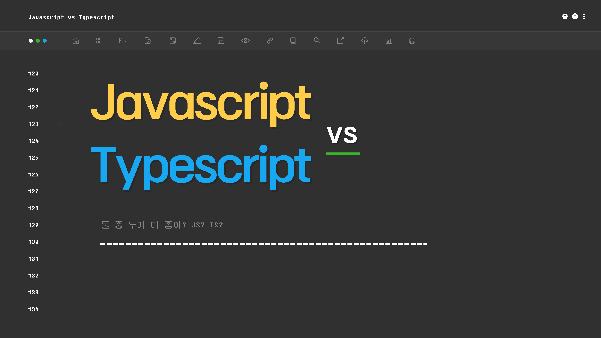

# 🖥 " 프론트엔드 기술세미나 - 1팀 "
 

## 💁🏻 " Team "
|                                                             **박찬진**                                                              |                                                                  **김지연**                                                                  |                                                                       **이정민**                                                                       |                                                                  **조윤주**                                                                  | 
|:--------------------------------------------------------------------------------------------------------------------------------:|:-----------------------------------------------------------------------------------------------------------------------------------------:|:---------------------------------------------------------------------------------------------------------------------------------------------------:|:-----------------------------------------------------------------------------------------------------------------------------------------:|
| [   @developerChans](https://github.com/developerChans) | [   @xixeonxim](https://github.com/xixeonxim) | [   @jeongmin07262](https://github.com/jeongmin07262) | [   @iamyuunzo](https://github.com/iamyuunzo) 
| 팀장 | 팀원 | 팀원 | 팀원 |
| $\color{blue}{\textsf{Team. TS}}$ | $\color{orange}{\textsf{Team. JS}}$ | $\color{blue}{\textsf{Team. TS}}$ | $\color{orange}{\textsf{Team. JS}}$ |

 

## 🖥 " 세미나 자료 공유 "
- Javascript와 Typescript를 비교하고, 상황에 따라 어떤 언어가 개발에 더 유리할지에 대해 발표.

$\color{gray}{\textsf{(누르면 발표자료 PDF로 넘어갑니다.)}}$

 

## 📚 " Reference "
**(1) Javascript**
1. https://www.samsungsds.com/kr/insights/ai-in-banking-in-2025.html (국내은행 사례)
2. https://www.simform.com/blog/companies-using-nodejs/ (해외은행 사례)
3. https://daily.dev/blog/top-10-javascript-communities-to-join-in-2024 (JS 커뮤니티 순위)
4. https://rootstack.com/en/blog/javascript-developer-banking-project (은행-JS이점)

 

**(2) Typescript** 
1. https://www.jetbrains.com/lp/devecosystem-2022/ (JS와 TS의 점유율)
2. https://yamoo9.gitbook.io/typescript/introduction/typescript (TypeScript가 필요한 이유)
3. https://typescript-kr.github.io/ (TypeScript가 필요한 이유)
4. https://reveur1996.tistory.com/146 (Ts와 Js의 차이점 키워드로 비교하기)
